# chaos-engineering-getting-started

 - [**Introduction**](#Introduction)
 - [**Chaos Engineering**](#chaos-engineering)
   - [**Principles**](#principles)
   - [**First Steps**](#first-steps)
   - [**Use Cases**](#use-cases)
   - [**Benefits**](#benefitss)
   - [**Challenges and Pitfalls**](#challenges-and-pitfalls)
   - [**Tools**](#tools)
 - [**Litmus Chaos**](#litmus-chaos)
   - [**Litmus Architecture**](#litmus-architecture) 
   - [**Litmus Components**](#litmus-components)
   - [**Experiment Workflow**](#experiment-workflow)
   - [**Chaos Center**](#chaos-center)
 - [**Demo**](#demo)
   - [**Source Code**](#source-code)
   - [**Environment Setup**](#environment-setup)
   - [**Experiments**](#experiments)
     - [**Sock Shop Workflow Template**](#sock-shop-workflow-template)
     - [**Container Kill**](#container-kill)
 - [**References**](#references)
 - [**Author**](#author)

## **Introduction**
This is a tutorial on how to get started with Chaos Engineering for Kubernetes. We will first discuss on how to bring understanding to a system that is fundamentally not understandable, followed by running a brief demo on Litmus Chaos tool.

## **Chaos Engineering**
The history of Chaos Engineering begins with Netflix migration from datacenter to AWS cloud public provider in 2010. Netflix engineers decided to develop a suite called Chaos Monkey to test various failure conditions and ensure proper customer experience.

Later on, Simian Army (a Chaos Monkey evolution) included tools to test AWS infrastructure and services resiliency againsts failures such as disabling an AWS region, dropping an availability zone, simulating network delays and outages, etc. 

The academic definition considers Chaos Engineering as the discipline of experimenting on a system in order to build confidence in the system’s capability to withstand turbulent conditions in production.

Chaos Engineering should not be confused with testing. Unit testing validates the expected behaviour of a component that is independent of all external components whereas integration testing checks the interaction of interdependant components. The uncertainty of complex systems such as microservices architectures requires a wider approach.  

Chaos Engineering methodologies imply the deliberate introduction of faulty conditions into a system to understand how the system will react and what could be its side effects.

## **Principles**
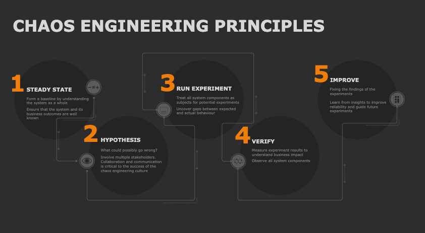

### **First Steps**
As with any scientific experiment, getting started with chaos engineering is a matter of culture. It requires communication, preparation, organization, and the ability to monitor the output and results.

First, you should understand the applications and architecture of the target environment in order to recognize the effects of the injected chaos. Being familiar with the baseline, creates a blueprint for monitoring during the testing and analyzing chaos output after.

Establish a hypothesis and foresee what could go wrong. With a clear idea of the system starting state, ask what could go wrong. Understand service level indicators and service level objectives and use them as a basis for establishing an assumption for how the system should work under pressure.

Introduce chaos one variable at a time. To keep control of the blast radius, introduce only a little chaos at a time, so you can appreciate the results. Be prepared to abort the experiment under certain conditions and also have a rollback plan if something goes wrong.

Monitor and record the results. Analyze the results to see how the application responds and whether testing achieved the teams expectations. Use investigation tools to understand the precise root causes of failures.

### **Benefits**
Embracing Chaos Engineering brings the following benefits:

- Increases resiliency and reliability by improving organization awareness about how systems perform under stress and how to make it more resilient. Production outages can lead to huge amount of losses to companies, therefore Chaos Engineering helps in the prevention of large impact in revenue. 

- Speeds up incident response by learning from failure scenarios. In that way, teams can speed troubleshooting and incident response. Chaos Engineering tries out teams response in the event of an incident. Also, proves observability and monitoring systems response. 

- Reduces production incidents for the future by improving the confidence and engagement of team members involved for carrying out disaster recovery and making applications highly reliable on every iteration. 

- Improves customer satisfaction since increased resilience and faster response times mean less downtime and high performance.

- Boosts business impact and accelerates innovation by extending organizations competitive advantage through saving time and resources. Chaos Engineering results generate synergies back to developers who quickly implement changes for improving the quality of the software released. 

### **Challenges and Pitfalls**
Chaos Engineering practice implies the following challenges and potential pitfalls:

- Beginning can be scary due to an unclear starting system state. Without this clarity, teams can have difficulty understanding the true effects of the test. This can diminish the effectiveness of chaos testing, and can put downstream systems at greater risk and make it harder to control the blast radius.

- Teams have limited time and resources. 

- Generates controversy and becomes political at management level due to the idea of potential unnecessary damage. In order to limit this, teams should avoid experiments that overrun the designated blast radius. The goal is narrowing down the cause of failure without unnecessarily introducing new points of failure.

- Lack of monitoring and observability. Without comprehensive observability, it is difficult to understand the starting system state and the business impact of injected failures. Lack of visibility makes challenging for teams to determine the root cause of an issue which complicates fixing and remediation.

## **Tools**
Chaos engineering tools help to automate the process of experimenting with failures and assessing the effect on applications and systems. 
The following table lists some popular chaos engineering tools:

| Tool | Open Source | Language | Works with | 
| ----------- | ----------- | ----------- | ----------- | 
| [Chaos Mesh](https://chaos-mesh.org) | :heavy_check_mark: | Go | Kubernetes, bare metal | 
| [Chaos Toolkit](https://chaostoolkit.org) | :heavy_check_mark: | Python | Kubernetes, bare metal, Cloud | 
| [Litmus Chaos](https://litmuschaos.io) | :heavy_check_mark: | TypeScript | Kubernetes, Kafka, Cloud | 
| [Gremlin](https://www.gremlin.com) | :x: | Python + others | Containers, Kubernetes, bare metal, Cloud |  
| [Chaos Blade](https://chaosblade.io) | :heavy_check_mark: | Go | Containers, Kubernetes, bare metal, Cloud |

Identify your prerequisites and select the tool that fits better your requirements.

## **Litmus Chaos**
Litmus is a Chaos Engineering Kubernetes native tool which provides for exhaustive experiments support for testing Kubernetes. Its main advantages are:

- Components declared as Kubernetes Custom Resource Definitions (CDRs).  
- Numerous out of the box experiments. 
- Experiments SDK available in Go, Ansible and Python for developing customized tests. 
- Chaos Portal graphical user interface with monitoring capabilities.  
- Integration with CICD tools such as GitHub Actions. 
- Experiment metrics can be imported to Prometheus. 

### **Litmus Architecture**
### **Litmus Components**
- Chaos Center
It is a centralized portal which provides a single pane of glass to configure, operate and monitor your experiments. The Center comes with the following features:
  - Workflow creation and management from Chaos Hub or pre-defined yaml files. 
  - User management control. It supports creation of users and teams with Role Based Access Control.
  - Monitor effect of chaos in real time with interleaved events and metrics from Prometheus Datasource
  - Visualize workflow run statistics and aggregated schedules

- Chaos Hub
Chaos experiments are the custom resources on Kubernetes. The YAML specifications for these custom resources are hosted at the public ChaosHub (https://hub.litmuschaos.io).

- Chaos Operator
This operator is built using the Operator SDK framework and manages the lifecycle of a chaos experiment.

- Chaos Custom Resource Definitions
Litmus comes with three main CRDs: ChaosEngine, ChaosExperiment, and ChaosResult. 
  - ChaosExperiment defines the experiment itself, actions, and their schedule. 
  - ChaosEngine connects an application or Kubernetes node to the specific ChaosExperiment
  - ChaosResult stores the results of the experiment. Operator exports it as Prometheus metrics.

- Chaos Scheduler
It supports the granular scheduling of chaos experiments.

- Chaos Metrics Exporter
It is a Prometheus metrics exporter. Chaos metrics such as the number, type of experiments, and their results are exported into Prometheus. These metrics and target application metrics are combined to plot graphs that can show the effect of chaos to the application service or performance.

- Chaos Events Exporter
Litmus generates a chaos event for every chaos action that it takes. These chaos events are stored in etcd, and later exported to an event receiver for doing correlation or debugging of a service affected by chaos injection.

### **Experiment Workflow**
The diagram below depicts the Litmus experiments workflow process:

Once a chaosengine object is created with active engineState attribute, Litmus Operator creates the chaos-runner pod in the target Kubernetes namespace. This runner checks experiment details and orchestrates the workflow. 

Target identification is something that makes Litmus different. To zero in on the target, the user has to insert a specific annotation on the deployment (more workloads are supported here: DaemonSet, StatefulSet and DeploymentConfig). Then, the user needs to modify the labels and fields in the chaosengine object (an example is shown below) so that Litmus can then locate all (or some) of the pods of the target deployment. 

Once the Operator verifies that all the above prerequisites are met (correct labelling, annotation, Chaosexperiment object, permissions), it will create a pod of the experiment runner, which is responsible for the execution of the experiment. This workflow allows for limiting the blast radius of an experiment, as well as for concurrent experiment executions.

## **Demo**
The goal of this demo is to install Litmus Chaos on a Kubernetes cluster (AWS EKS based) and execute a couple of experiments in order to gain a wider vision on Chaos Engineering for Kubernetes features. 

### **Source Code**
Source code can be cloned from [github](https://github.com/JavierBaltar/chaos-engineering-getting-started).

```bash
git clone https://github.com/JavierBaltar/chaos-engineering-getting-started.git
cd chaos-engineering-getting-started
```

```bash
tree
.
├── chaos-engine-kill-container.yaml
├── infra
├── kill-container-sa.yaml
├── kill-container.yaml
├── nginx-deployment.yaml
└── nginx-hpa.yaml
```

### **Environment Setup**
The first step is installing Litmus Chaos. In this case, Litmus is deployed on an Amazon EKS cluster using the following tools: eksctl, helm and kubectl.

Once your AWS credentials profile is configure, create a new EKS cluster issuing the following eksctl command:
```bash
eksctl create cluster -f infra/eks-cluster.yaml
```
Output:
```bash
eksctl create cluster -f infra/eks-cluster.yaml
2022-05-03 13:02:13 [ℹ]  eksctl version 0.95.0
2022-05-03 13:02:13 [ℹ]  using region eu-west-1
2022-05-03 13:02:13 [ℹ]  setting availability zones to [eu-west-1c eu-west-1b eu-west-1a]
2022-05-03 13:02:13 [ℹ]  subnets for eu-west-1c - public:192.168.0.0/19 private:192.168.96.0/19
2022-05-03 13:02:13 [ℹ]  subnets for eu-west-1b - public:192.168.32.0/19 private:192.168.128.0/19
2022-05-03 13:02:13 [ℹ]  subnets for eu-west-1a - public:192.168.64.0/19 private:192.168.160.0/19
2022-05-03 13:02:13 [ℹ]  nodegroup "litmus-demo-ng" will use "" [AmazonLinux2/1.22]
2022-05-03 13:02:13 [ℹ]  using Kubernetes version 1.22
2022-05-03 13:02:13 [ℹ]  creating EKS cluster "litmus-demo" in "eu-west-1" region with managed nodes
2022-05-03 13:02:13 [ℹ]  1 nodegroup (litmus-demo-ng) was included (based on the include/exclude rules)
2022-05-03 13:02:13 [ℹ]  will create a CloudFormation stack for cluster itself and 0 nodegroup stack(s)
2022-05-03 13:02:13 [ℹ]  will create a CloudFormation stack for cluster itself and 1 managed nodegroup stack(s)
2022-05-03 13:02:13 [ℹ]  if you encounter any issues, check CloudFormation console or try 'eksctl utils describe-stacks --region=eu-west-1 --cluster=litmus-demo'
2022-05-03 13:02:13 [ℹ]  Kubernetes API endpoint access will use default of {publicAccess=true, privateAccess=false} for cluster "litmus-demo" in "eu-west-1"
2022-05-03 13:02:13 [ℹ]  CloudWatch logging will not be enabled for cluster "litmus-demo" in "eu-west-1"
2022-05-03 13:02:13 [ℹ]  you can enable it with 'eksctl utils update-cluster-logging --enable-types={SPECIFY-YOUR-LOG-TYPES-HERE (e.g. all)} --region=eu-west-1 --cluster=litmus-demo'
2022-05-03 13:02:13 [ℹ]
2 sequential tasks: { create cluster control plane "litmus-demo",
    2 sequential sub-tasks: {
        wait for control plane to become ready,
        create managed nodegroup "litmus-demo-ng",
    }
}
2022-05-03 13:02:13 [ℹ]  building cluster stack "eksctl-litmus-demo-cluster"
2022-05-03 13:02:14 [ℹ]  deploying stack "eksctl-litmus-demo-cluster"
2022-05-03 13:02:44 [ℹ]  waiting for CloudFormation stack "eksctl-litmus-demo-cluster"
2022-05-03 13:03:14 [ℹ]  waiting for CloudFormation stack "eksctl-litmus-demo-cluster"
2022-05-03 13:04:14 [ℹ]  waiting for CloudFormation stack "eksctl-litmus-demo-cluster"
2022-05-03 13:05:15 [ℹ]  waiting for CloudFormation stack "eksctl-litmus-demo-cluster"
2022-05-03 13:06:15 [ℹ]  waiting for CloudFormation stack "eksctl-litmus-demo-cluster"
2022-05-03 13:07:15 [ℹ]  waiting for CloudFormation stack "eksctl-litmus-demo-cluster"
2022-05-03 13:08:15 [ℹ]  waiting for CloudFormation stack "eksctl-litmus-demo-cluster"
2022-05-03 13:09:15 [ℹ]  waiting for CloudFormation stack "eksctl-litmus-demo-cluster"
2022-05-03 13:10:16 [ℹ]  waiting for CloudFormation stack "eksctl-litmus-demo-cluster"
2022-05-03 13:11:16 [ℹ]  waiting for CloudFormation stack "eksctl-litmus-demo-cluster"
2022-05-03 13:12:16 [ℹ]  waiting for CloudFormation stack "eksctl-litmus-demo-cluster"
2022-05-03 13:14:24 [ℹ]  building managed nodegroup stack "eksctl-litmus-demo-nodegroup-litmus-demo-ng"
2022-05-03 13:14:24 [ℹ]  deploying stack "eksctl-litmus-demo-nodegroup-litmus-demo-ng"
2022-05-03 13:14:24 [ℹ]  waiting for CloudFormation stack "eksctl-litmus-demo-nodegroup-litmus-demo-ng"
2022-05-03 13:14:55 [ℹ]  waiting for CloudFormation stack "eksctl-litmus-demo-nodegroup-litmus-demo-ng"
2022-05-03 13:15:42 [ℹ]  waiting for CloudFormation stack "eksctl-litmus-demo-nodegroup-litmus-demo-ng"
2022-05-03 13:16:23 [ℹ]  waiting for CloudFormation stack "eksctl-litmus-demo-nodegroup-litmus-demo-ng"
2022-05-03 13:17:52 [ℹ]  waiting for CloudFormation stack "eksctl-litmus-demo-nodegroup-litmus-demo-ng"
2022-05-03 13:17:52 [ℹ]  waiting for the control plane availability...
2022-05-03 13:17:52 [✔]  saved kubeconfig as "/Users/javier/.kube/config"
2022-05-03 13:17:52 [ℹ]  no tasks
2022-05-03 13:17:52 [✔]  all EKS cluster resources for "litmus-demo" have been created
2022-05-03 13:17:53 [ℹ]  nodegroup "litmus-demo-ng" has 4 node(s)
2022-05-03 13:17:53 [ℹ]  node "ip-192-168-20-123.eu-west-1.compute.internal" is ready
2022-05-03 13:17:53 [ℹ]  node "ip-192-168-49-106.eu-west-1.compute.internal" is ready
2022-05-03 13:17:53 [ℹ]  node "ip-192-168-54-251.eu-west-1.compute.internal" is ready
2022-05-03 13:17:53 [ℹ]  node "ip-192-168-74-122.eu-west-1.compute.internal" is ready
2022-05-03 13:17:53 [ℹ]  waiting for at least 2 node(s) to become ready in "litmus-demo-ng"
2022-05-03 13:17:53 [ℹ]  nodegroup "litmus-demo-ng" has 4 node(s)
2022-05-03 13:17:53 [ℹ]  node "ip-192-168-20-123.eu-west-1.compute.internal" is ready
2022-05-03 13:17:53 [ℹ]  node "ip-192-168-49-106.eu-west-1.compute.internal" is ready
2022-05-03 13:17:53 [ℹ]  node "ip-192-168-54-251.eu-west-1.compute.internal" is ready
2022-05-03 13:17:53 [ℹ]  node "ip-192-168-74-122.eu-west-1.compute.internal" is ready
2022-05-03 13:17:54 [ℹ]  kubectl command should work with "/Users/javier/.kube/config", try 'kubectl get nodes'
2022-05-03 13:17:54 [✔]  EKS cluster "litmus-demo" in "eu-west-1" region is ready

kubectl get nodes
NAME                                           STATUS   ROLES    AGE   VERSION
ip-192-168-20-123.eu-west-1.compute.internal   Ready    <none>   87s   v1.22.6-eks-7d68063
ip-192-168-49-106.eu-west-1.compute.internal   Ready    <none>   85s   v1.22.6-eks-7d68063
ip-192-168-54-251.eu-west-1.compute.internal   Ready    <none>   88s   v1.22.6-eks-7d68063
ip-192-168-74-122.eu-west-1.compute.internal   Ready    <none>   88s   v1.22.6-eks-7d68063

```

Before installing Litmus using Helm chart, override the default NodePort service to LoadBalancer. 
```bash
cat <<EOF > override-service-type-litmus.yaml
portal:
  server:
    service:
      type: ClusterIP
  frontend:
    service:
      type: LoadBalancer
EOF

```

Create a Litmus namespace:
```bash
kubectl create namespace litmus
```

Install Litmus.

As a prerequisite, you will need to have Helm installed on your system. 
Next, add the LitmusChaos Helm repository and then issue the helm install command below. 

```bash
helm repo add litmuschaos https://litmuschaos.github.io/litmus-helm/
"litmuschaos" has been added to your repositories

helm install chaos litmuschaos/litmus --namespace=litmus -f override-service-type-litmus.yaml
NAME: chaos
LAST DEPLOYED: Tue May  3 13:20:23 2022
NAMESPACE: litmus
STATUS: deployed
REVISION: 1
TEST SUITE: None
NOTES:
Thank you for installing litmus 😀

Your release is named chaos and it's installed to namespace: litmus.

Visit https://docs.litmuschaos.io to find more info.

```

List the services. The frontend service external endpoint might be displayed as pending for a minute. 

```bash
kubectl get services -n litmus
NAME                               TYPE           CLUSTER-IP       EXTERNAL-IP                                                               PORT(S)             AGE
chaos-litmus-auth-server-service   ClusterIP      10.100.134.234   <none>                                                                    9003/TCP,3030/TCP   16s
chaos-litmus-frontend-service      LoadBalancer   10.100.138.168   ad6c5181576aa45d6bd2e70c837c29bf-1312593859.eu-west-1.elb.amazonaws.com   9091:30356/TCP      16s
chaos-litmus-headless-mongo        ClusterIP      10.100.34.134    <none>                                                                    27017/TCP           16s
chaos-litmus-mongo                 ClusterIP      10.100.180.113   <none>                                                                    27017/TCP           16s
chaos-litmus-server-service        ClusterIP      10.100.249.254   <none>                                                                    9002/TCP,8000/TCP   16s

```
NOTE: It may take few minutes to complete the rollout. 

Browse the external-ip:9091 in your browser.
After login to the portal using default credentials (username: admin/ password: litmus), you will be asked to change your password.


Once the login is completed, Chaos Operator is deployed in the Litmus namespace. 

```bash
kubectl get pods -n litmus
NAME                                        READY   STATUS    RESTARTS   AGE
chaos-litmus-auth-server-785847bc86-dz8cz   1/1     Running   0          3m49s
chaos-litmus-frontend-847cf9ddbd-hz82b      1/1     Running   0          3m49s
chaos-litmus-mongo-0                        1/1     Running   0          3m49s
chaos-litmus-server-85574f6c69-qp2jv        1/1     Running   0          3m49s

kubectl get pods -n litmus
NAME                                        READY   STATUS    RESTARTS   AGE
chaos-exporter-7d4c89d779-csg2g             1/1     Running   0          48s
chaos-litmus-auth-server-785847bc86-dz8cz   1/1     Running   0          7m26s
chaos-litmus-frontend-847cf9ddbd-hz82b      1/1     Running   0          7m26s
chaos-litmus-mongo-0                        1/1     Running   0          7m26s
chaos-litmus-server-85574f6c69-qp2jv        1/1     Running   0          7m26s
chaos-operator-ce-d698f8478-crpr9           1/1     Running   0          48s
event-tracker-8567f867-6kqqs                1/1     Running   0          47s
subscriber-67b8bfcc89-4w48j                 1/1     Running   0          47s
workflow-controller-856d568f68-cv7kn        1/1     Running   0          49s
```

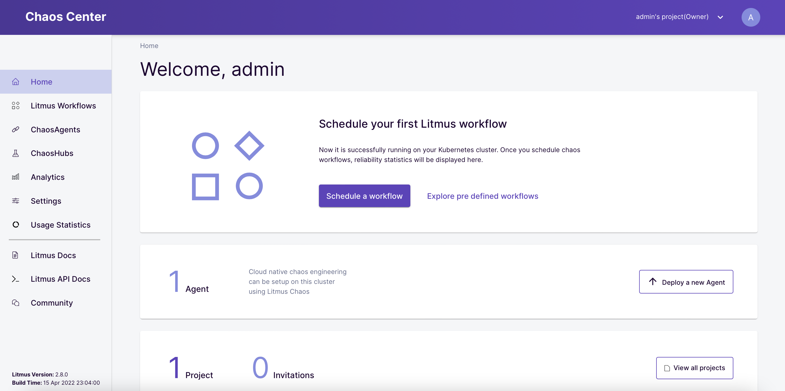

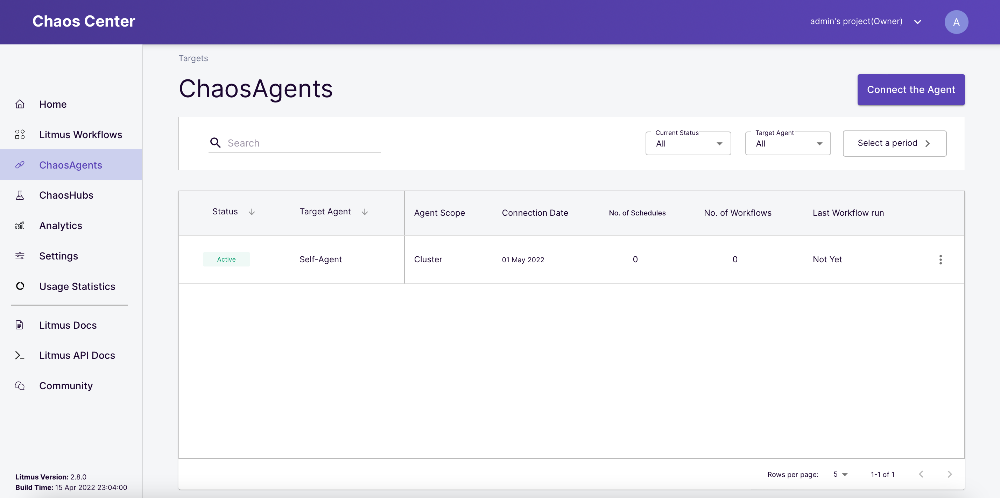


## Enabling Monitoring
Create a monitoring namespace:
```bash
kubectl create namespace monitoring
```

Create the operator to instantiate all CRDs
```bash
kubectl -n monitoring apply -f utils/prometheus/prometheus-operator/
```

Deploy monitoring components
```bash
kubectl -n monitoring apply -f utils/metrics-exporters-with-service-monitors/node-exporter/
kubectl -n monitoring apply -f utils/metrics-exporters-with-service-monitors/kube-state-metrics/
```

Deploy prometheus instance and all the service monitors for targets
```bash
kubectl -n monitoring apply -f utils/prometheus/prometheus-configuration/
```

Deploy Grafana
```bash
kubectl -n monitoring apply -f utils/grafana/
```

Go back to Chaos Center and browse the Analytics tab.

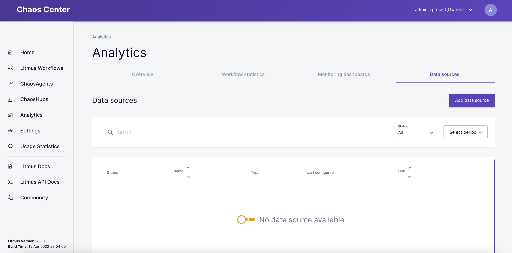

Add the recently created Prometheus endpoint as data source:

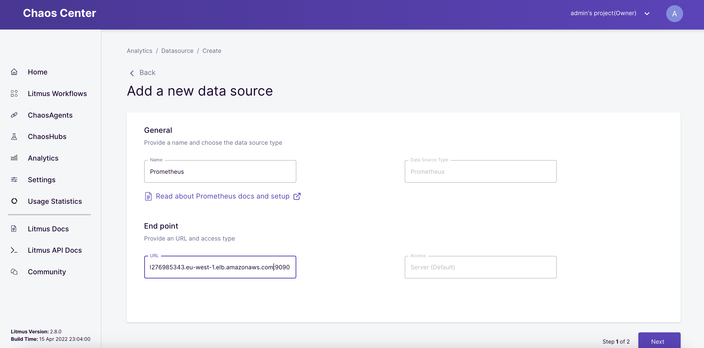

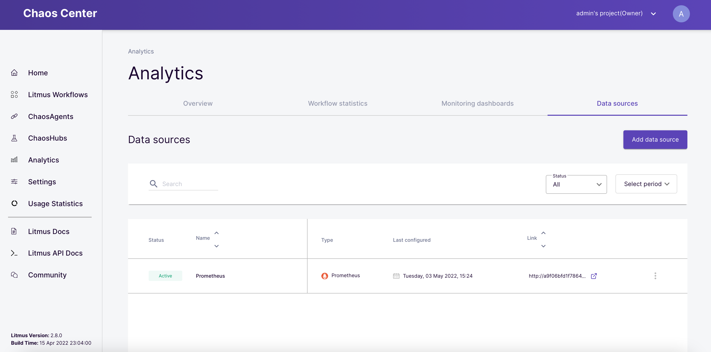

Monitoring dashboards can be added for displaying metrics:

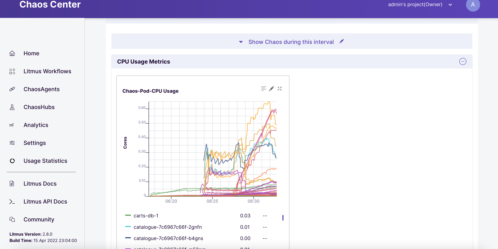

Similarly, metrics and indicators Grafana dashboards can be observed using Grafana dashboards:

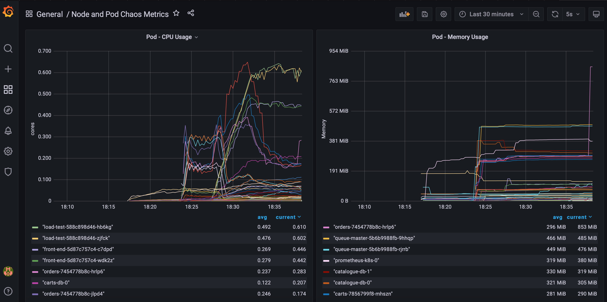

## Experiments

### Sock Shop Workflow Template
LitmusChaos comes with three pre-defined workflows, which deploy a bunch of microservices to play with. We will be running a Sock Shop workflow, which installs a sock-shop application, generate loads, inject chaos on sock-shop, uninstall the application and revert the chaos. 

Browse the dashboard and select Schedule a Workflow.

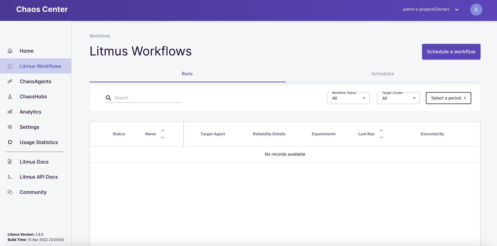

In the Workflows dashboard, select the Self-Agent and then click on Next.

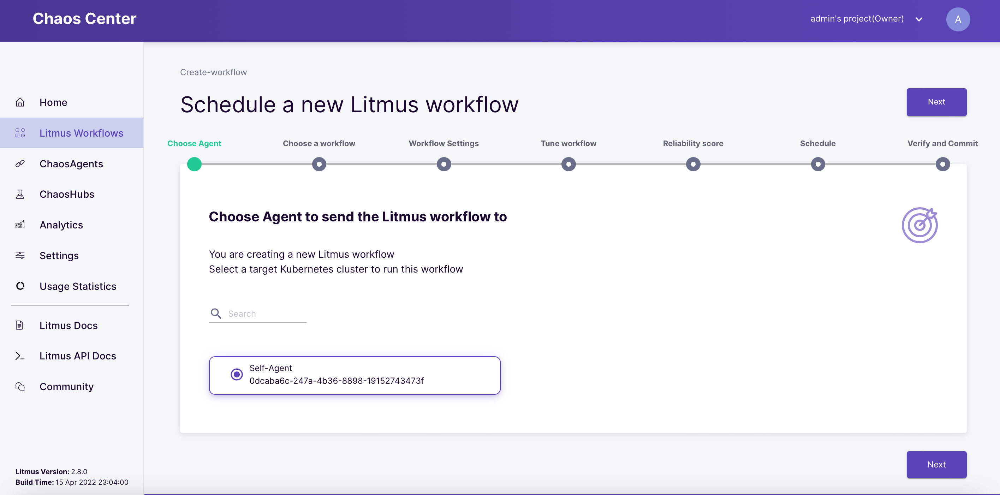

Select Create a Workflow from Pre-defined Templates and then select sock shop and then click on Next.

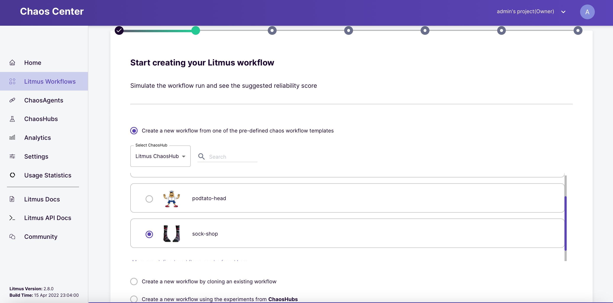

The workflow can be modified by editing the experiment manifest and adding or arranging the experiments settings. 

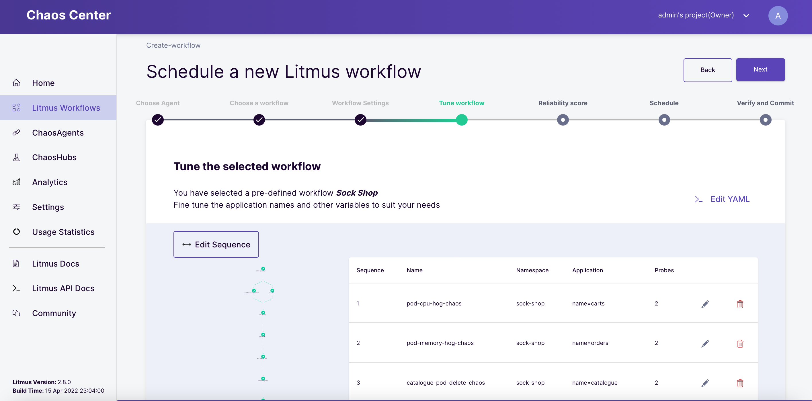

The weights of the experiments can be tuned in order to set the importance of each experiment according to your requirements to get a meaningful reliability score. 

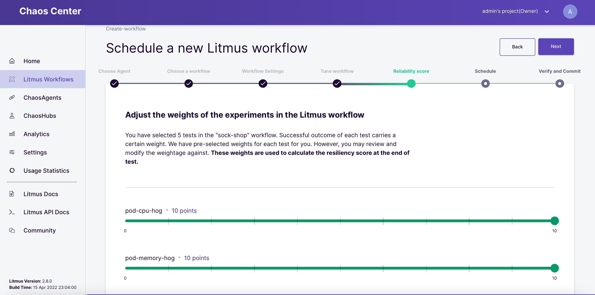

On the next tab, you can schedule the workflow if the experiment needs to run at specific intervals.

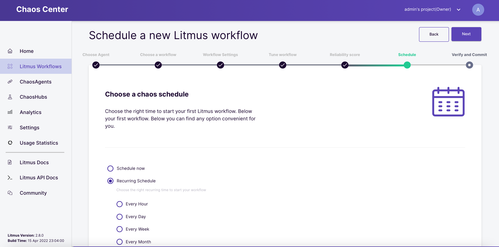

Finally, click on Finish to run the workflow. 

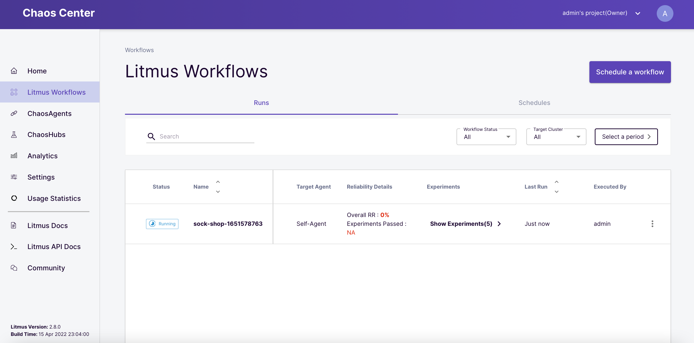

The workflow has deployed the sock shop application in the corresponding namespace:

```bash
kubectl get pods -n sock-shop
NAME                               READY   STATUS    RESTARTS   AGE
carts-7856799f8-55qtb              0/1     Running   0          3m17s
carts-7856799f8-hlsgw              1/1     Running   0          3m17s
carts-db-0                         1/1     Running   0          3m17s
carts-db-1                         1/1     Running   0          2m27s
catalogue-7c6967c66f-bczg9         1/1     Running   0          3m17s
catalogue-7c6967c66f-d9cqv         1/1     Running   0          3m17s
catalogue-db-0                     1/1     Running   0          3m17s
catalogue-db-1                     1/1     Running   0          2m28s
front-end-5d87c757c4-crbbz         1/1     Running   0          3m17s
front-end-5d87c757c4-fvl8w         1/1     Running   0          3m17s
git-app-checker-5bd479bbcb-48kfd   1/1     Running   0          3m16s
orders-7454778b8c-9jr6r            1/1     Running   0          3m17s
orders-7454778b8c-xwsjv            0/1     Running   0          3m17s
orders-db-0                        1/1     Running   0          3m17s
orders-db-1                        1/1     Running   0          2m31s
payment-6ddc6b495f-9zr87           1/1     Running   0          3m17s
payment-6ddc6b495f-f684t           1/1     Running   0          3m17s
qps-test-5554f4cb8d-lsgpq          1/1     Running   0          3m16s
queue-master-5b6b9988fb-kn44s      0/1     Running   0          3m17s
queue-master-5b6b9988fb-szcw4      0/1     Running   0          3m17s
rabbitmq-667d94879f-5t7xt          1/1     Running   0          3m17s
rabbitmq-667d94879f-hjzxj          1/1     Running   0          3m16s
shipping-6b7bcccb87-qvsbd          1/1     Running   0          3m16s
shipping-6b7bcccb87-sg5w9          0/1     Running   0          3m16s
user-5c855f4c56-fhn5b              0/1     Running   0          3m16s
user-5c855f4c56-xt7dm              0/1     Running   0          3m16s
user-db-0                          1/1     Running   0          3m17s
user-db-1                          1/1     Running   0          2m7s
```

After few minutes, the workflow run execution is completed. The workflow details are available using the graph view or the table view as shown below.

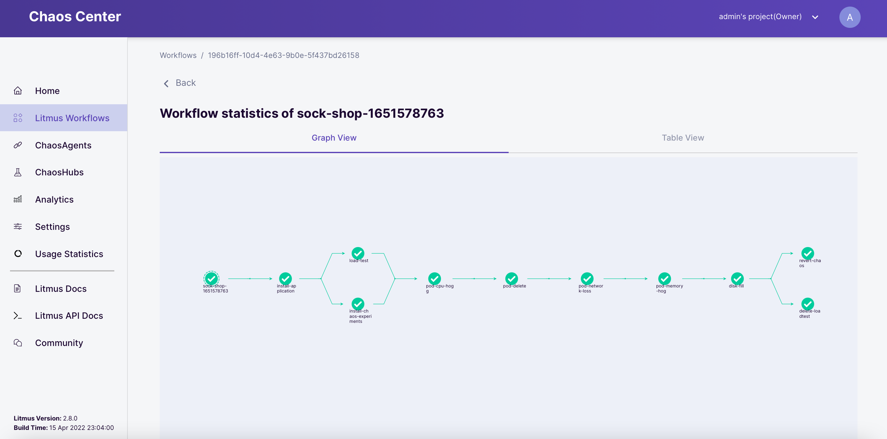

Click on View Logs & Results to check out the logs and chaos results for the different experiments. 

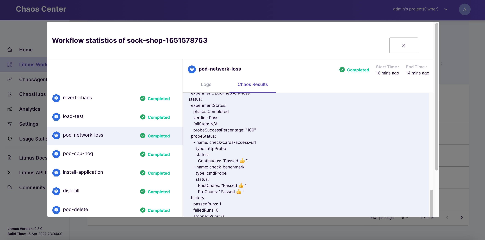

### Container Kill
Now, let´s pick the container kill experiment to go through the details of running an experiment.
First of all, I will deploy a nginx based sample application.

```bash
kubectl apply -f src/nginx/nginx-deployment.yaml -n testing
kubectl apply -f src/nginx/nginx-hpa.yaml -n testing
```

Couple of pods are running. 
```bash
kubectl get pods -n testing
NAME                          READY   STATUS    RESTARTS   AGE
app-sample-55b8878cfb-75l2p   0/1     Running   0          14s
app-sample-55b8878cfb-wbcmc   1/1     Running   0          36s
```

Creating a load balancer to expose the application endpoint.
```bash
kubectl expose deployment app-sample --type=LoadBalancer --port=80  -n testing
service/app-sample exposed

kubectl get svc -n testing
NAME         TYPE           CLUSTER-IP      EXTERNAL-IP                                                              PORT(S)        AGE
app-sample   LoadBalancer   10.100.221.67   a587b6b418a0a475d9860ed3f85f4b4e-800872529.eu-west-1.elb.amazonaws.com   80:31203/TCP   9s

```

Install the experiments on the target testing namespace:

```bash
kubectl apply -f https://hub.litmuschaos.io/api/chaos/2.8.0\?file\=charts/generic/experiments.yaml -n testing 


kubectl get chaosexperiments -n testing
NAME                      AGE
container-kill            56s
disk-fill                 57s
docker-service-kill       53s
k8-pod-delete             54s
kubelet-service-kill      55s
node-cpu-hog              56s
node-drain                54s
node-io-stress            54s
node-memory-hog           53s
node-poweroff             54s
node-restart              55s
node-taint                54s
pod-autoscaler            56s
pod-cpu-hog               57s
pod-cpu-hog-exec          54s
pod-delete                55s
pod-dns-error             56s
pod-dns-spoof             55s
pod-io-stress             53s
pod-memory-hog            56s
pod-memory-hog-exec       55s
pod-network-corruption    55s
pod-network-duplication   54s
pod-network-latency       57s
pod-network-loss          56s
pod-network-partition     56s

```
In order to enable the experiment execution against the deployment, I need to add the annotation litmuschaos.io/chaos="true". 

```bash
kubectl annotate deployment/app-sample litmuschaos.io/chaos="true" -n testing
kubectl describe deployment/app-sample -n testing


Name:                   app-sample
Namespace:              testing
CreationTimestamp:      Tue, 03 May 2022 15:35:52 +0200
Labels:                 app=app-sample
                        app.kubernetes.io/name=app-sample
Annotations:            deployment.kubernetes.io/revision: 1
                        kubectl.kubernetes.io/last-applied-configuration:
                          {"apiVersion":"apps/v1","kind":"Deployment","metadata":{"annotations":{},"labels":{"app":"app-sample","app.kubernetes.io/name":"app-sample...
                        litmuschaos.io/chaos: true
Selector:               app.kubernetes.io/name=app-sample

```

Creating experiment service account, role and rolebinding:

```bash

kubectl apply -f kill-container-sa.yaml -n testing

serviceaccount/container-kill-sa created
role.rbac.authorization.k8s.io/container-kill-sa created
rolebinding.rbac.authorization.k8s.io/container-kill-sa created

```

The Chaos Engine resource consists of general specifications, experiment variables and probe details.
Litmus currently supports four types of Probes:

- httpProbe: To query health/downstream URIs.
- cmdProbe: To execute any user-desired health-check function implemented as a shell command.
- k8sProbe: To perform CRUD operations against native & custom Kubernetes resources.
- promProbe: To execute promql queries and match prometheus metrics for specific criteria.

```yaml
apiVersion: litmuschaos.io/v1alpha1
kind: ChaosEngine
metadata:
  name: app-sample-chaos
  namespace: testing
spec:
  annotationCheck: "true"
  engineState: "active"
  appinfo:
    appns: "testing"
    applabel: "app.kubernetes.io/name=app-sample"
    appkind: "deployment"
  chaosServiceAccount: container-kill-sa
  monitoring: true
  jobCleanUpPolicy: "delete"
  experiments:
    - name: container-kill
      spec:
        components:
          env:
            # provide the chaos interval
            - name: CHAOS_INTERVAL
              value: "10"

            # provide the total chaos duration
            - name: TOTAL_CHAOS_DURATION
              value: "20"

            - name: CONTAINER_RUNTIME
              value: "docker"

            - name: SOCKET_PATH
              value: "/var/run/docker.sock"
        probe:
          - name: "check-frontend-access-url"
            type: "httpProbe"
            httpProbe/inputs:
              url: "http://a587b6b418a0a475d9860ed3f85f4b4e-800872529.eu-west-1.elb.amazonaws.com:80"
              insecureSkipVerify: false
              method:
                get:
                  criteria: ==
                  responseCode: "200"
            mode: "Continuous"
            runProperties:
              probeTimeout: 1
              interval: 5
              retry: 1
              probePollingInterval: 1
```

Launch the experiment:
```bash

kubectl apply -f chaos-engine-kill-container.yaml -n testing
chaosengine.litmuschaos.io/app-sample-chaos created

```

Chaos runner is deployed.

```bash
kubectl get pods -n testing
NAME                             READY   STATUS    RESTARTS   AGE
app-sample-55b8878cfb-75l2p      1/1     Running   0          21m
app-sample-55b8878cfb-wbcmc      1/1     Running   0          21m
app-sample-chaos-runner          1/1     Running   0          18s
container-kill-cdykvi--1-w6qhv   1/1     Running   0          13s
```

```bash


kubectl get pods -n testing
NAME                             READY   STATUS    RESTARTS     AGE
app-sample-55b8878cfb-75l2p      0/1     Running   1 (8s ago)   21m
app-sample-55b8878cfb-wbcmc      1/1     Running   0            21m
app-sample-chaos-runner          1/1     Running   0            46s
container-kill-cdykvi--1-w6qhv   1/1     Running   0            41s
container-kill-helper-cxfvxr     1/1     Running   0            19s
```

The result of the experiment.

```bash
kubectl describe chaosresult app-sample-chaos-container-kill -n testing

Name:         app-sample-chaos-container-kill
Namespace:    testing
Labels:       app.kubernetes.io/component=experiment-job
              app.kubernetes.io/part-of=litmus
              app.kubernetes.io/runtime-api-usage=true
              app.kubernetes.io/version=2.8.0
              chaosUID=af0b4eb5-9d0d-4899-9021-161beb0a258a
              controller-uid=7ab3c405-995c-493d-b05a-c59595dc8ac3
              job-name=container-kill-rvkc87
              name=container-kill
Annotations:  <none>
API Version:  litmuschaos.io/v1alpha1
Kind:         ChaosResult
Metadata:
  Creation Timestamp:  2022-05-03T16:56:35Z
  Generation:          2
  Managed Fields:
    API Version:  litmuschaos.io/v1alpha1
    Fields Type:  FieldsV1
    fieldsV1:
      f:metadata:
        f:labels:
          .:
          f:app.kubernetes.io/component:
          f:app.kubernetes.io/part-of:
          f:app.kubernetes.io/runtime-api-usage:
          f:app.kubernetes.io/version:
          f:chaosUID:
          f:controller-uid:
          f:job-name:
          f:name:
      f:spec:
        .:
        f:engine:
        f:experiment:
      f:status:
        .:
        f:experimentStatus:
        f:history:
        f:probeStatus:
    Manager:         experiments
    Operation:       Update
    Time:            2022-05-03T16:56:35Z
  Resource Version:  13579
  UID:               c85aa975-97cf-499a-bfaf-937e4cb8ac72
Spec:
  Engine:      app-sample-chaos
  Experiment:  container-kill
Status:
  Experiment Status:
    Fail Step:                 N/A
    Phase:                     Completed
    Probe Success Percentage:  100
    Verdict:                   Pass
  History:
    Failed Runs:   0
    Passed Runs:   1
    Stopped Runs:  0
    Targets:
      Chaos Status:  targeted
      Kind:          pod
      Name:          app-sample-55b8878cfb-pss82
  Probe Status:
    Name:  check-frontend-access-url
    Status:
      Continuous:  Passed 👍
    Type:          httpProbe
Events:
  Type    Reason   Age   From                            Message
  ----    ------   ----  ----                            -------
  Normal  Awaited  84s   container-kill-rvkc87--1-m8n7b  experiment: container-kill, Result: Awaited
  Normal  Pass     3s    container-kill-rvkc87--1-m8n7b  experiment: container-kill, Result: Pass

```

Once the experiment is finish, the chaos runner and experiment pods are deleted. For troubleshooting purposes, you can modify the "jobCleanPolicy" attribute to "retain". This way, the pods will remain and logs are available:


```bash
apiVersion: litmuschaos.io/v1alpha1
kind: ChaosEngine
metadata:
  name: app-sample-chaos
  namespace: testing
spec:
  annotationCheck: "true"
  engineState: "active"
  appinfo:
    appns: "testing"
    applabel: "app.kubernetes.io/name=app-sample"
    appkind: "deployment"
  chaosServiceAccount: container-kill-sa
  monitoring: true
  jobCleanUpPolicy: "retain"
```

```bash
kubectl get pods -n testing
NAME                             READY   STATUS      RESTARTS        AGE
app-sample-55b8878cfb-pss82      1/1     Running     2 (12m ago)     15m
app-sample-55b8878cfb-x2kg8      1/1     Running     2 (4m19s ago)   15m
app-sample-chaos-runner          0/1     Completed   0               4m59s
container-kill-nrayke--1-bc5kq   0/1     Completed   0               4m58s
```


```bash
kubectl logs container-kill-nrayke--1-bc5kq -n testing
time="2022-05-03T17:04:12Z" level=info msg="Experiment Name: container-kill"
time="2022-05-03T17:04:12Z" level=info msg="[PreReq]: Getting the ENV for the container-kill experiment"
time="2022-05-03T17:04:14Z" level=info msg="[PreReq]: Updating the chaos result of container-kill experiment (SOT)"
time="2022-05-03T17:04:18Z" level=info msg="The application information is as follows" Label="app.kubernetes.io/name=app-sample" Target Container= Chaos Duration=20 Container Runtime=docker Namespace=testing
time="2022-05-03T17:04:18Z" level=info msg="[Status]: Verify that the AUT (Application Under Test) is running (pre-chaos)"
time="2022-05-03T17:04:18Z" level=info msg="[Status]: The Container status are as follows" Readiness=true container=app-sample Pod=app-sample-55b8878cfb-pss82
time="2022-05-03T17:04:18Z" level=info msg="[Status]: The status of Pods are as follows" Pod=app-sample-55b8878cfb-pss82 Status=Running
time="2022-05-03T17:04:18Z" level=info msg="[Status]: The Container status are as follows" Readiness=true container=app-sample Pod=app-sample-55b8878cfb-x2kg8
time="2022-05-03T17:04:18Z" level=info msg="[Status]: The status of Pods are as follows" Pod=app-sample-55b8878cfb-x2kg8 Status=Running
time="2022-05-03T17:04:22Z" level=info msg="[Probe]: The http probe information is as follows" URL="http://app-sample.testing.svc.cluster.local:80" Run Properties="{1 5 1 1 0 false}" Mode=Continuous Phase=PreChaos Name=check-frontend-access-url
time="2022-05-03T17:04:22Z" level=info msg="[Probe]: HTTP get method informations" ResponseCode=200 ResponseTimeout=0 Name=check-frontend-access-url URL="http://app-sample.testing.svc.cluster.local:80" Criteria="=="
time="2022-05-03T17:04:22Z" level=info msg="[Probe]: {Actual value: 200}, {Expected value: 200}, {Operator: ==}"
time="2022-05-03T17:04:22Z" level=info msg="[Info]: The tunables are:" Sequence=parallel PodsAffectedPerc=0
time="2022-05-03T17:04:22Z" level=info msg="[Chaos]:Number of pods targeted: 1"
time="2022-05-03T17:04:22Z" level=info msg="Target pods list for chaos, [app-sample-55b8878cfb-x2kg8]"
time="2022-05-03T17:04:24Z" level=info msg="[Info]: Details of application under chaos injection" NodeName=ip-192-168-94-245.eu-west-1.compute.internal ContainerName=app-sample PodName=app-sample-55b8878cfb-x2kg8
time="2022-05-03T17:04:24Z" level=info msg="[Status]: Checking the status of the helper pods"
time="2022-05-03T17:04:28Z" level=info msg="[Probe]: HTTP get method informations" ResponseCode=200 ResponseTimeout=0 Name=check-frontend-access-url URL="http://app-sample.testing.svc.cluster.local:80" Criteria="=="
time="2022-05-03T17:04:34Z" level=info msg="[Probe]: HTTP get method informations" ResponseTimeout=0 Name=check-frontend-access-url URL="http://app-sample.testing.svc.cluster.local:80" Criteria="==" ResponseCode=200
time="2022-05-03T17:04:36Z" level=info msg="container-kill-helper-davwvs helper pod is in Running state"
time="2022-05-03T17:04:38Z" level=info msg="[Wait]: waiting till the completion of the helper pod"
time="2022-05-03T17:04:38Z" level=info msg="helper pod status: Running"
time="2022-05-03T17:04:40Z" level=info msg="helper pod status: Running"
time="2022-05-03T17:04:40Z" level=info msg="[Probe]: HTTP get method informations" ResponseTimeout=0 Name=check-frontend-access-url URL="http://app-sample.testing.svc.cluster.local:80" Criteria="==" ResponseCode=200
time="2022-05-03T17:04:41Z" level=info msg="helper pod status: Running"
time="2022-05-03T17:04:42Z" level=info msg="helper pod status: Running"
time="2022-05-03T17:04:43Z" level=info msg="helper pod status: Running"
time="2022-05-03T17:04:44Z" level=info msg="helper pod status: Running"
time="2022-05-03T17:04:45Z" level=info msg="helper pod status: Running"
time="2022-05-03T17:04:46Z" level=info msg="helper pod status: Running"
time="2022-05-03T17:04:46Z" level=info msg="[Probe]: HTTP get method informations" ResponseTimeout=0 Name=check-frontend-access-url URL="http://app-sample.testing.svc.cluster.local:80" Criteria="==" ResponseCode=200
time="2022-05-03T17:04:47Z" level=info msg="helper pod status: Running"
time="2022-05-03T17:04:48Z" level=info msg="helper pod status: Running"
time="2022-05-03T17:04:49Z" level=info msg="helper pod status: Running"
time="2022-05-03T17:04:50Z" level=info msg="helper pod status: Running"
time="2022-05-03T17:04:51Z" level=info msg="helper pod status: Running"
time="2022-05-03T17:04:52Z" level=info msg="helper pod status: Running"
time="2022-05-03T17:04:52Z" level=info msg="[Probe]: HTTP get method informations" Criteria="==" ResponseCode=200 ResponseTimeout=0 Name=check-frontend-access-url URL="http://app-sample.testing.svc.cluster.local:80"
time="2022-05-03T17:04:53Z" level=info msg="helper pod status: Running"
time="2022-05-03T17:04:54Z" level=info msg="helper pod status: Running"
time="2022-05-03T17:04:55Z" level=info msg="helper pod status: Running"
time="2022-05-03T17:04:56Z" level=info msg="helper pod status: Running"
time="2022-05-03T17:04:57Z" level=info msg="helper pod status: Running"
time="2022-05-03T17:04:58Z" level=info msg="helper pod status: Running"
time="2022-05-03T17:04:58Z" level=info msg="[Probe]: HTTP get method informations" ResponseTimeout=0 Name=check-frontend-access-url URL="http://app-sample.testing.svc.cluster.local:80" Criteria="==" ResponseCode=200
time="2022-05-03T17:04:59Z" level=info msg="helper pod status: Running"
time="2022-05-03T17:05:00Z" level=info msg="helper pod status: Running"
time="2022-05-03T17:05:01Z" level=info msg="helper pod status: Running"
time="2022-05-03T17:05:02Z" level=info msg="helper pod status: Running"
time="2022-05-03T17:05:03Z" level=info msg="helper pod status: Running"
time="2022-05-03T17:05:04Z" level=info msg="helper pod status: Running"
time="2022-05-03T17:05:04Z" level=info msg="[Probe]: HTTP get method informations" ResponseCode=200 ResponseTimeout=0 Name=check-frontend-access-url URL="http://app-sample.testing.svc.cluster.local:80" Criteria="=="
time="2022-05-03T17:05:05Z" level=info msg="helper pod status: Running"
time="2022-05-03T17:05:06Z" level=info msg="helper pod status: Running"
time="2022-05-03T17:05:07Z" level=info msg="helper pod status: Running"
time="2022-05-03T17:05:08Z" level=info msg="helper pod status: Running"
time="2022-05-03T17:05:09Z" level=info msg="helper pod status: Running"
time="2022-05-03T17:05:10Z" level=info msg="helper pod status: Running"
time="2022-05-03T17:05:10Z" level=info msg="[Probe]: HTTP get method informations" URL="http://app-sample.testing.svc.cluster.local:80" Criteria="==" ResponseCode=200 ResponseTimeout=0 Name=check-frontend-access-url
time="2022-05-03T17:05:11Z" level=info msg="helper pod status: Running"
time="2022-05-03T17:05:12Z" level=info msg="helper pod status: Running"
time="2022-05-03T17:05:13Z" level=info msg="helper pod status: Running"
time="2022-05-03T17:05:14Z" level=info msg="helper pod status: Running"
time="2022-05-03T17:05:15Z" level=info msg="helper pod status: Running"
time="2022-05-03T17:05:16Z" level=info msg="helper pod status: Running"
time="2022-05-03T17:05:16Z" level=info msg="[Probe]: HTTP get method informations" ResponseCode=200 ResponseTimeout=0 Name=check-frontend-access-url URL="http://app-sample.testing.svc.cluster.local:80" Criteria="=="
time="2022-05-03T17:05:17Z" level=info msg="helper pod status: Succeeded"
time="2022-05-03T17:05:17Z" level=info msg="[Status]: The running status of Pods are as follows" Status=Succeeded Pod=container-kill-helper-davwvs
time="2022-05-03T17:05:18Z" level=info msg="[Cleanup]: Deleting all the helper pods"
time="2022-05-03T17:05:20Z" level=info msg="[Confirmation]: container-kill chaos has been injected successfully"
time="2022-05-03T17:05:20Z" level=info msg="[Status]: Verify that the AUT (Application Under Test) is running (post-chaos)"
time="2022-05-03T17:05:20Z" level=info msg="[Status]: The Container status are as follows" container=app-sample Pod=app-sample-55b8878cfb-pss82 Readiness=true
time="2022-05-03T17:05:20Z" level=info msg="[Status]: The status of Pods are as follows" Pod=app-sample-55b8878cfb-pss82 Status=Running
time="2022-05-03T17:05:20Z" level=info msg="[Status]: The Container status are as follows" container=app-sample Pod=app-sample-55b8878cfb-x2kg8 Readiness=true
time="2022-05-03T17:05:20Z" level=info msg="[Status]: The status of Pods are as follows" Pod=app-sample-55b8878cfb-x2kg8 Status=Running
time="2022-05-03T17:05:22Z" level=info msg="[Probe]: HTTP get method informations" ResponseCode=200 ResponseTimeout=0 Name=check-frontend-access-url URL="http://app-sample.testing.svc.cluster.local:80" Criteria="=="
time="2022-05-03T17:05:24Z" level=info msg="[Probe]: check-frontend-access-url probe has been Passed 😄 " ProbeName=check-frontend-access-url ProbeType=httpProbe ProbeInstance=PostChaos ProbeStatus=Passed
time="2022-05-03T17:05:24Z" level=info msg="[Probe]: check-frontend-access-url probe has been Passed 😄 " ProbeInstance=PostChaos ProbeStatus=Passed ProbeName=check-frontend-access-url ProbeType=httpProbe
time="2022-05-03T17:05:24Z" level=info msg="[The End]: Updating the chaos result of container-kill experiment (EOT)"

```


## **Scheduling Experiments**

The ChaosSchedule is a user-facing chaos custom resource with namespaced scope and is used to inject chaos at a specific time or repeat it for a certain period. It schedules multiple instances of chaos by creating the chaosengine CR at the specified times.
Litmus experiments can be launched on a scheduled basis. ChaosSchedule object supports the schedule attribute 

Immediate:
```yaml
apiVersion: litmuschaos.io/v1alpha1
kind: ChaosSchedule
metadata:
  name: schedule-nginx
spec:
  schedule:
    now: true
  engineTemplateSpec:
    engineState: 'active'
    appinfo:
      appns: 'default'
      applabel: 'app=nginx'
      appkind: 'deployment'
    annotationCheck: 'true'

```


Specific timestamp:

```yaml

apiVersion: litmuschaos.io/v1alpha1
kind: ChaosSchedule
metadata:
  name: schedule-nginx
spec:
  schedule:
    once:
      #should be modified according to current UTC Time
      executionTime: "2020-05-12T05:47:00Z" 
  engineTemplateSpec:
      engineState: 'active'
      appinfo:
        appns: 'default'
        applabel: 'app=nginx'
        appkind: 'deployment'
      annotationCheck: 'true'
```
Time range:
```yaml

apiVersion: litmuschaos.io/v1alpha1
kind: ChaosSchedule
metadata:
  name: schedule-nginx
spec:
  schedule:
    repeat:
      timeRange:
        #should be modified according to current UTC Time
        startTime: "2020-05-12T05:47:00Z"   
        endTime: "2020-09-13T02:58:00Z"   
      properties:
        #format should be like "10m" or "2h" accordingly for minutes and hours
        minChaosInterval: "2m"   
  engineTemplateSpec:
    engineState: 'active'
    appinfo:
      appns: 'default'
      applabel: 'app=nginx'
      appkind: 'deployment'
    annotationCheck: 'true'
```

Specific work hours:
```yaml

apiVersion: litmuschaos.io/v1alpha1
kind: ChaosSchedule
metadata:
  name: schedule-nginx
spec:
  schedule:
    repeat:
      properties:
        #format should be like "10m" or "2h" accordingly for minutes and hours
        minChaosInterval: "2m"   
      workHours:
        # format should be <starting-hour-number>-<ending-hour-number>(inclusive)
        includedHours: 0-12
  engineTemplateSpec:
    engineState: 'active'
    appinfo:
      appns: 'default'
      applabel: 'app=nginx'
      appkind: 'deployment'
    # It can be true/false
    annotationCheck: 'true'
```

Chaos Schedules can be halted or resumed as per need issuing the steps below:

Edit the ChaosSchedule custom resource:
```bash
kubectl edit chaosschedule schedule-nginx
```


Change the spec.scheduleState to halt
```bash
spec:
  scheduleState: halt
  ...
```

Similarly, edit the chaosschedule for resuming a halted schedule:
```bash
kubectl edit chaosschedule schedule-nginx
```
Change the spec.scheduleState to active

```bash
spec:
  scheduleState: active
  ...
```


Finally, destroy the EKS cluster. 
```bash
eksctl delete cluster --name litmus-demo
2022-05-03 17:28:57 [ℹ]  eksctl version 0.95.0
2022-05-03 17:28:57 [ℹ]  using region eu-west-1
2022-05-03 17:29:02 [ℹ]  deleting EKS cluster "litmus-demo"
2022-05-03 17:29:03 [ℹ]  will drain 0 unmanaged nodegroup(s) in cluster "litmus-demo"
2022-05-03 17:29:03 [ℹ]  deleted 0 Fargate profile(s)
2022-05-03 17:29:04 [✔]  kubeconfig has been updated
2022-05-03 17:29:04 [ℹ]  cleaning up AWS load balancers created by Kubernetes objects of Kind Service or Ingress
2022-05-03 17:32:34 [ℹ]
2 sequential tasks: { delete nodegroup "litmus-demo-ng", delete cluster control plane "litmus-demo" [async]
}
2022-05-03 17:32:34 [ℹ]  will delete stack "eksctl-litmus-demo-nodegroup-litmus-demo-ng"
2022-05-03 17:32:34 [ℹ]  waiting for stack "eksctl-litmus-demo-nodegroup-litmus-demo-ng" to get deleted
2022-05-03 17:32:34 [ℹ]  waiting for CloudFormation stack "eksctl-litmus-demo-nodegroup-litmus-demo-ng"
2022-05-03 17:42:39 [ℹ]  waiting for CloudFormation stack "eksctl-litmus-demo-nodegroup-litmus-demo-ng"
2022-05-03 17:42:39 [ℹ]  will delete stack "eksctl-litmus-demo-cluster"
2022-05-03 17:42:39 [✔]  all cluster resources were deleted
```


## **References**
- [Litmus Chaos](https://litmuschaos.io/)
- [Principles of Chaos Engineering](https://principlesofchaos.org/)
- [Awesome Chaos Engineering](https://github.com/dastergon/awesome-chaos-engineering)

## **Author**
Javier Baltar - [LinkedIn](https://www.linkedin.com/in/javierbaltar/) | [Github](https://github.com/JavierBaltar)
