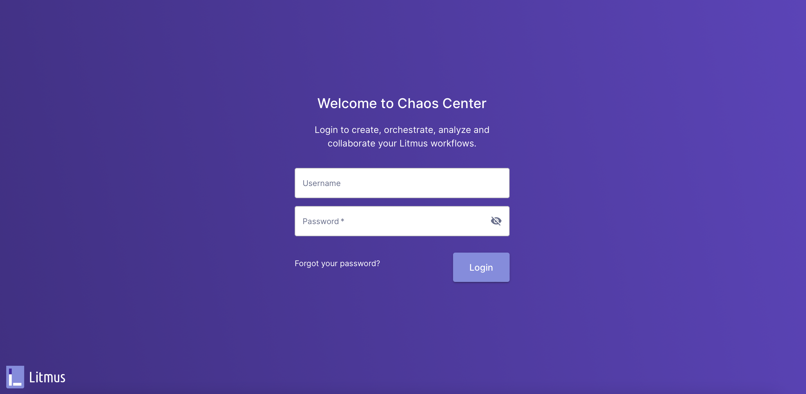

# chaos-engineering-getting-started
Chaos Engineering for Kubernetes introduction

 - [**Introduction**](#Introduction)
 - [**Chaos Engineering**](#chaos-engineering)
 - [**Chaos Engineering Principles**](#chaos-engineering-principles)
 - [**Chaos Engineering Tools**](#chaos-engineering-tools)
 - [**Litmus Chaos**](#litmus-chaos)
   - [**Architecture**](#litmus-architecture) 
   - [**Components**](#litmus-components)
   - [**Chaos Portal**](#chaos-portal)
     - [**Components**](#components)
 - [**Demo**](#demo)
   - [**Source Code**](#source-code)
   - [**Environment Setup**](#environment-setup)
 - 
 - [**References**](#referencess)
 - [**Author**](#author)

## **Introduction**
The main objective of this demo is discussing on how to bring understanding to a system that is fundamentally not understandable.

## **Chaos Engineering**

Started back in the days in Netflix and amazon moving to datacenter to cloud public provider aws specifically (chaos monkey to simian army)

Chaos Engineering is the discipline of experimenting on a system in order to build confidence in the system’s capability to withstand turbulent conditions in production.

Chaos engineering started in 2010 during Netflix migration to cloud infrastructure. Netflix engineers decided to develop a suite called Chaos Monkey to test various failure conditions and ensure customer experience.

Later on, Simian Army (a Chaos Monkey evolution) included tools to test AWS infrastrucure and services resiliency againsts failures such as disabling an AWS region, dropping an availability zone, simulating network delays and outages, etc. 


## **Chaos Engineering Principles**


## **Chaos Engineering Tools**

| Tool | Open Source | Notes | 
| ----------- | ----------- | ----------- | 
| [Chaos Mesh](https://chaos-mesh.org) | :heavy_check_mark: |
| [Chaos Toolkit](https://chaostoolkit.org) | :x: |
| [Litmus Chaos](https://litmuschaos.io) | :heavy_check_mark: |
| [Gremlin](https://www.gremlin.com) | :x: |
| [Chaos Blade](https://chaosblade.io) | :heavy_check_mark: |

## **Litmus Chaos**
Litmus is a Chaos Engineering Kubernetes native tool which provides for exhaustive experiments support for testing containers, pods, and nodes. It has good documentation for each of its experiment and also provides a GitHub repository of experiments, open for public contribution.

Its main advantages are:
- Components declared as Kubernetes Custom Resource Definitions (CDRs)
- Plenty of out of the box experiments
- Experiments SDK available in Go, Ansible and Python. 
- Chaos Portal GUI 
- Integration with CICD tools
- Experiment metrics can be imported to Prometheus. 

### **Architecture**
### **Components**
- ChaosExperiment defines the experiment itself, required actions, and their schedule

- ChaosEngine connects an application or Kubernetes node to the specific ChaosExperiment

- ChaosResult stores the results of the experiment. Operator exports it as Prometheus metrics.

#### Experiments Workflow

Once a chaosengine object is created, Litmus creates the Chaos runner pod in the target namespace. This runner will orchestrate the experiment in the specified namespace and against the specified targets. 

Target identification is something that makes Litmus different. To zero in on the target, the user has to insert a specific annotation on the deployment (more workloads are supported here: DaemonSet, StatefulSet and DeploymentConfig). Then, the user needs to modify the labels and fields in the chaosengine object (an example is shown below) so that Litmus can then locate all (or some) of the pods of the target deployment. 

Once the Operator verifies that all the above prerequisites are met (correct labelling, annotation, Chaosexperiment object, permissions), it will create a pod of the experiment runner, which is responsible for the execution of the experiment. This workflow allows for limiting the blast radius of an experiment, as well as for concurrent experiment executions.

### **Chaos Portal**


## **Demo**

### **Source Code**

Source code can be cloned from [github](https://github.com/JavierBaltar/chaos-engineering-getting-started).

```bash
git clone https://github.com/JavierBaltar/chaos-engineering-getting-started.git
cd chaos-engineering-getting-started
```

### **Environment Setup**
Litmus is deployed on an Amazon EKS cluster using the following tools: eksctl, helm and kubectl. 
Create a new EKS cluster using eksctl:
```bash
eksctl create cluster -f infra/eks-cluster.yaml
```
Output:
```bash
2022-05-01 14:51:03 [ℹ]  eksctl version 0.95.0
2022-05-01 14:51:03 [ℹ]  using region us-east-1
2022-05-01 14:51:04 [ℹ]  setting availability zones to [us-east-1c us-east-1a]
2022-05-01 14:51:04 [ℹ]  subnets for us-east-1c - public:192.168.0.0/19 private:192.168.64.0/19
2022-05-01 14:51:04 [ℹ]  subnets for us-east-1a - public:192.168.32.0/19 private:192.168.96.0/19
2022-05-01 14:51:04 [ℹ]  nodegroup "eks-litmus-demo-ng" will use "" [AmazonLinux2/1.21]
2022-05-01 14:51:04 [ℹ]  using Kubernetes version 1.21
2022-05-01 14:51:04 [ℹ]  creating EKS cluster "eks-litmus-demo2" in "us-east-1" region with managed nodes
2022-05-01 14:51:04 [ℹ]  1 nodegroup (eks-litmus-demo-ng) was included (based on the include/exclude rules)
2022-05-01 14:51:04 [ℹ]  will create a CloudFormation stack for cluster itself and 0 nodegroup stack(s)
2022-05-01 14:51:04 [ℹ]  will create a CloudFormation stack for cluster itself and 1 managed nodegroup stack(s)
2022-05-01 14:51:04 [ℹ]  if you encounter any issues, check CloudFormation console or try 'eksctl utils describe-stacks --region=us-east-1 --cluster=eks-litmus-demo2'
2022-05-01 14:51:04 [ℹ]  Kubernetes API endpoint access will use default of {publicAccess=true, privateAccess=false} for cluster "eks-litmus-demo2" in "us-east-1"
2022-05-01 14:51:04 [ℹ]  CloudWatch logging will not be enabled for cluster "eks-litmus-demo2" in "us-east-1"
2022-05-01 14:51:04 [ℹ]  you can enable it with 'eksctl utils update-cluster-logging --enable-types={SPECIFY-YOUR-LOG-TYPES-HERE (e.g. all)} --region=us-east-1 --cluster=eks-litmus-demo2'
2022-05-01 14:51:04 [ℹ]
2 sequential tasks: { create cluster control plane "eks-litmus-demo2",
    2 sequential sub-tasks: {
        wait for control plane to become ready,
        create managed nodegroup "eks-litmus-demo-ng",
    }
}
2022-05-01 14:51:04 [ℹ]  building cluster stack "eksctl-eks-litmus-demo2-cluster"
2022-05-01 14:51:05 [ℹ]  deploying stack "eksctl-eks-litmus-demo2-cluster"
2022-05-01 14:51:35 [ℹ]  waiting for CloudFormation stack "eksctl-eks-litmus-demo2-cluster"
2022-05-01 15:05:21 [ℹ]  building managed nodegroup stack "eksctl-eks-litmus-demo2-nodegroup-eks-litmus-demo-ng"
2022-05-01 15:05:22 [ℹ]  deploying stack "eksctl-eks-litmus-demo2-nodegroup-eks-litmus-demo-ng"
2022-05-01 15:05:22 [ℹ]  waiting for CloudFormation stack "eksctl-eks-litmus-demo2-nodegroup-eks-litmus-demo-ng"
2022-05-01 15:08:56 [ℹ]  waiting for CloudFormation stack "eksctl-eks-litmus-demo2-nodegroup-eks-litmus-demo-ng"
2022-05-01 15:08:56 [ℹ]  waiting for the control plane availability...
2022-05-01 15:08:57 [✔]  saved kubeconfig as "/Users/javier/.kube/config"
2022-05-01 15:08:57 [ℹ]  no tasks
2022-05-01 15:08:57 [✔]  all EKS cluster resources for "eks-litmus-demo2" have been created
2022-05-01 15:08:57 [ℹ]  nodegroup "eks-litmus-demo-ng" has 2 node(s)
2022-05-01 15:08:57 [ℹ]  node "ip-192-168-52-59.ec2.internal" is ready
2022-05-01 15:08:57 [ℹ]  node "ip-192-168-6-34.ec2.internal" is ready
2022-05-01 15:08:57 [ℹ]  waiting for at least 2 node(s) to become ready in "eks-litmus-demo-ng"
2022-05-01 15:08:57 [ℹ]  nodegroup "eks-litmus-demo-ng" has 2 node(s)
2022-05-01 15:08:57 [ℹ]  node "ip-192-168-52-59.ec2.internal" is ready
2022-05-01 15:08:57 [ℹ]  node "ip-192-168-6-34.ec2.internal" is ready
2022-05-01 15:08:59 [ℹ]  kubectl command should work with "/Users/javier/.kube/config", try 'kubectl get nodes'
2022-05-01 15:08:59 [✔]  EKS cluster "eks-litmus-demo2" in "us-east-1" region is ready

kubectl get nodes
NAME                            STATUS   ROLES    AGE     VERSION
ip-192-168-52-59.ec2.internal   Ready    <none>   2m52s   v1.21.5-eks-9017834
ip-192-168-6-34.ec2.internal    Ready    <none>   3m5s    v1.21.5-eks-9017834
```

Before installing Litmus using Helm chart, override the default NodePort service to LoadBalancer. 
```bash
cat <<EOF > override-service-type-litmus.yaml
portal:
  server:
    service:
      type: ClusterIP
  frontend:
    service:
      type: LoadBalancer
EOF

```
Install Litmus:

```bash
helm repo add litmuschaos https://litmuschaos.github.io/litmus-helm/
"litmuschaos" has been added to your repositories

helm install chaos litmuschaos/litmus --namespace=litmus -f override-service-type-litmus.yaml
NAME: chaos
LAST DEPLOYED: Sun May  1 15:16:30 2022
NAMESPACE: litmus
STATUS: deployed
REVISION: 1
TEST SUITE: None
NOTES:
Thank you for installing litmus 😀

Your release is named chaos and it's installed to namespace: litmus.

```



Enabling Monitoring


## **References**
- [Litmus Chaos](https://litmuschaos.io/)
- [Principles of Chaos Engineering](https://principlesofchaos.org/)

## **Author**
Javier Baltar - [linkedIn](https://www.linkedin.com/in/javierbaltar/) | [github](https://github.com/JavierBaltar)
